# Примеры

## Содержание
- [Инструкция](#инструкция)
- [Деталь 1](#деталь-1)
- [Деталь 2](#деталь-2)
- [Деталь 3](#деталь-3)
- [Вал](#вал)
- [Вал 2](#вал-2)
- [Крышка](#крышка)
- [Лофт](#лофт)
- [Фланец](#фланец)

## Инструкция
Для того чтобы собрать детали из примеров, необходимо:
1. Установить платформу NanoCAD (рекомендуется последняя версия)
2. Скачать SDK в [клубе разработчиков](https://developer.nanocad.ru) для соответсвующей версии NanoCAD'a
3. Изменить пути к зависимостям в файле проекта  

## Деталь 1
Деталь, которую необходимо было разработать:
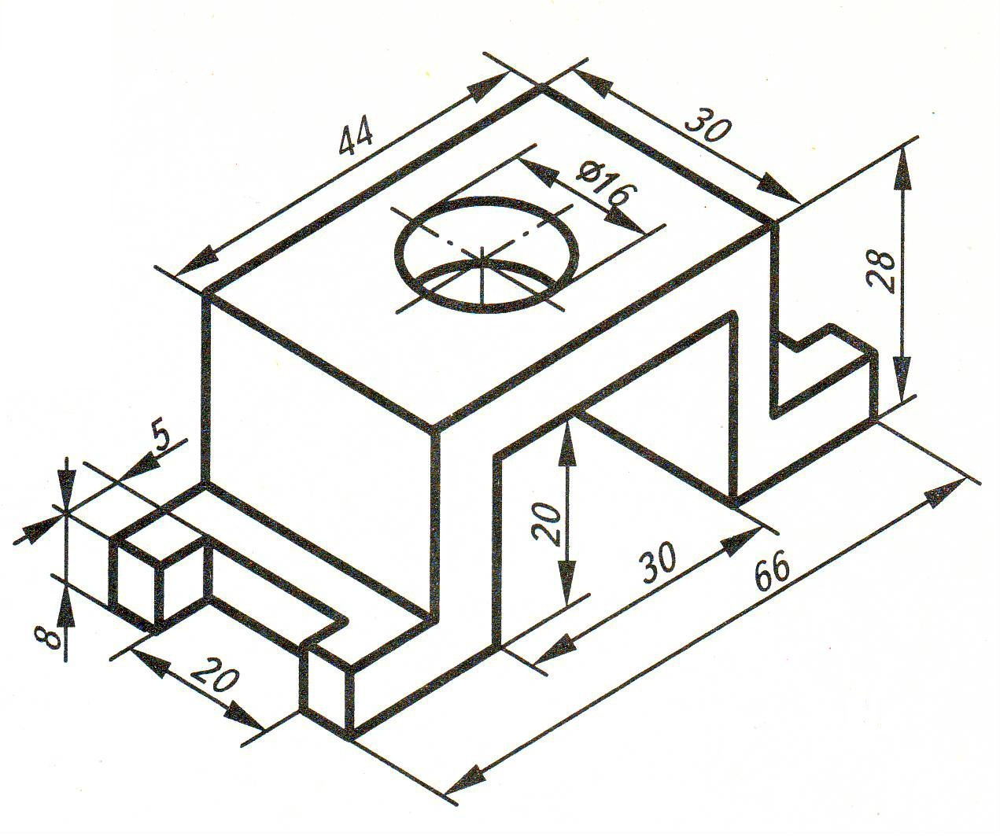

Полученный результат:
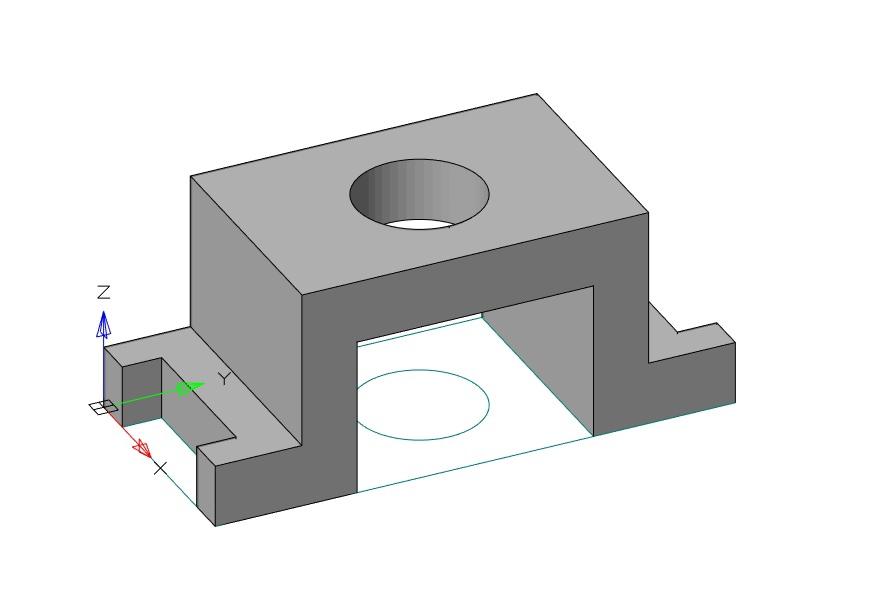

Файл с кодом примера: [Detail1](./Detail1)

## Деталь 2
Полученный результат: 
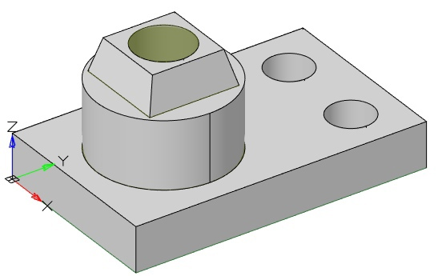

Файл с кодом примера: [Detail2](./Detail2)

## Деталь 3

Полученный результат: 
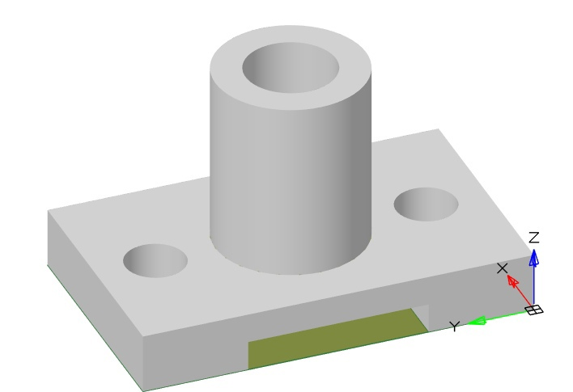

Файл с кодом примера: [Detail3](./Detail3)

## Вал 

Полученный результат: 
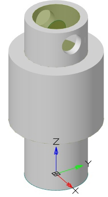

Файл с кодом примера: [Shaft](./Shaft)

## Вал 2

Полученный результат: 
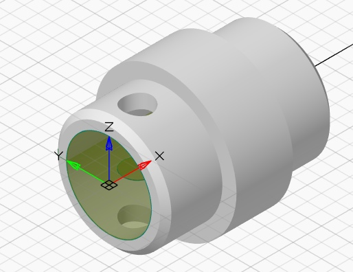

Файл с кодом примера: [Shaft2](./Shaft2)

## Крышка 

Полученный результат: 
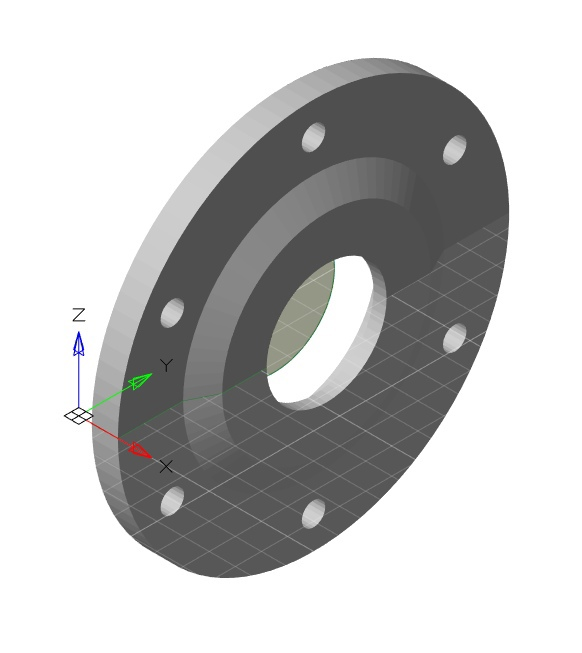

Файл с кодом примера: [Cap](./Cap)

## Лофт

Полученный результат: 
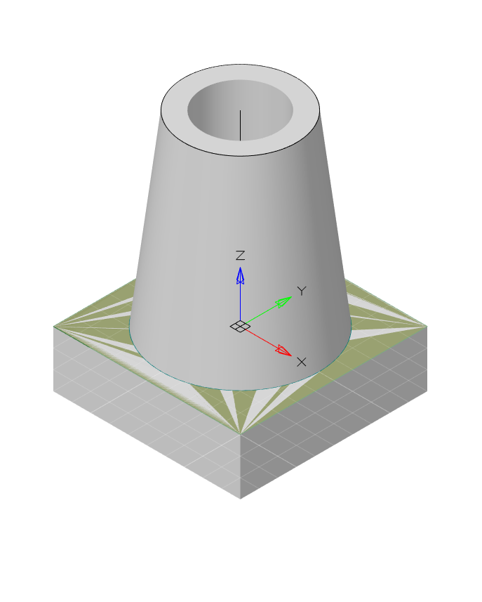

Файл с кодом примера: [Loft](./Loft)

## Фланец

Деталь, которую необходимо было разработать:
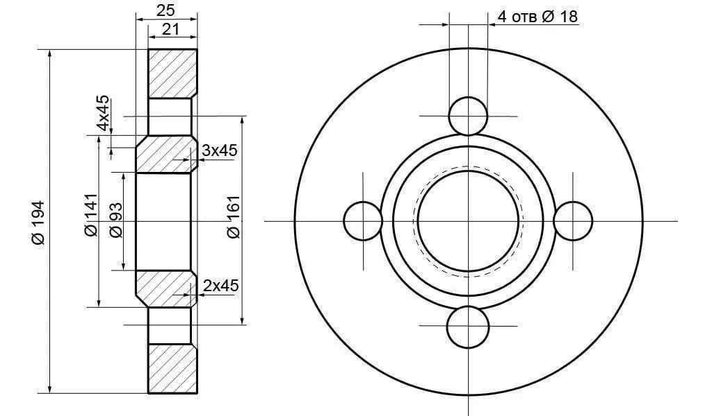

Полученный результат:
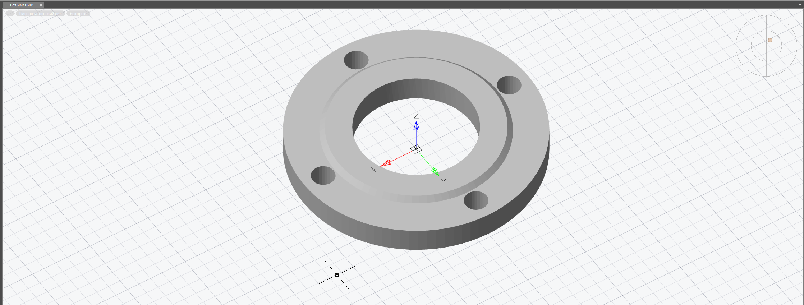
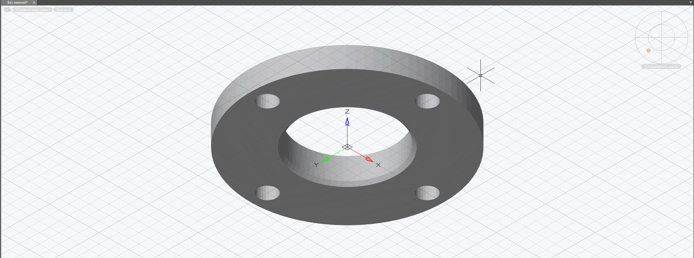

Файл с кодом примера: [Flanger](./Flanger)
