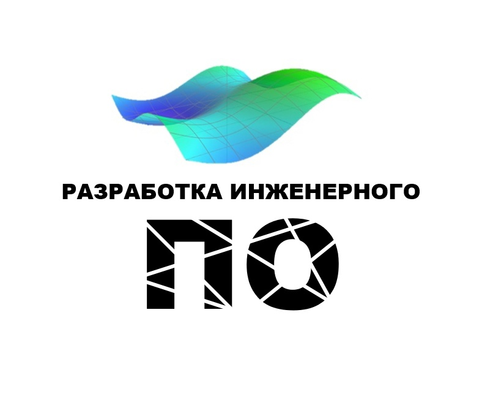

# NanoCAD  

## Что такое "NanoCAD"?  
NanoCAD – это российская платформа для проектирования и моделирования объектов различной сложности. Поддержка форматов *.dwg и IFC делает ее отличным решением для совмещения САПР- и BIM-технологий. Функционал платформы может быть расширен с помощью специальных модулей. 
Платформа nanoCAD имеет открытый API, что позволяет создавать модули и приложения, которые расширяют базовый функционал платформы.

## Наши задачи
Мы работаем с API nanoCAD для построения 3D моделей. Сейчас мы занимаем созданием 3д-моделей с помощью кода.

## Участники

### 1 курс
- [Алексанян Гарник Мгерович 234-321](Участники/Алексанян%20Гарник%20Мгерович%20234-321)
- [Володин Данила Евгеньевич 231-324](Участники/Володин%20Данила%20Евгеньевич%20231-324)
- [Зайцева Инга Юрьевна 231-324](Участники/Зайцева%20Инга%20Юрьевна%20231-324)
- [Цветкова София Ильгаровна 231-324](Участники/Цветкова%20София%20Ильгаровна%20231-324)
- [Старков Матвей Антонович 231-324](Участники/Старков%20Матвей%20Антонович%20231-324)
- [Сарычев Евгений Алексеевич 231-325](Участники/Сарычев%20Евгений%20Алексеевич%20231-325)
- [Андреянов Савелий Николаевич 231-326](Участники/Андреянов%20Савелий%20Николаевич%20231-326)
- [Буханцева Анастасия Андреевна 231-334](Участники/Буханцева%20Анастасия%20Андреевна%20231-334)
- [Гаджиламаммаев Тимур Юнусович 231-325](Участники/Гаджиламаммаев%20Тимур%20Юнусович%20231-325)
- [Герба Андрей Владимирович 231-113](Участники/Герба%20Андрей%20Владимирович%20231-113)
- [Дубцов Максим Сергеевич 231-361](Участники/Дубцов%20Максим%20Сергеевич%20231-361)
- [Емельянов Даниил Евгеньевич 231-326](Участники/Емельянов%20Даниил%20Евгеньевич%20231-326)
- [Табачный Сергей Александрович 231-325](Участники/Табачный%20Сергей%20Александрович%20231-325)
- [Каргин Михаил Сергеевич 231-326](Участники/Каргин%20Михаил%20Сергеевич%20231-326)
- [Клинюшин Сергей Сергеевич 231-326](Участники/Клинюшин%20Сергей%20Сергеевич%20231-326)
- [Мягков Артём Владиславович 231-324](Участники/Мягков%20Артём%20Владиславович%20231-324)
- [Панфилова Валерия Андреевна 231-3310](Участники/Панфилова%20Валерия%20Андреевна%20231-3310)
- [Ревина Анастасия Романовна 231-325](Участники/Ревина%20Анастасия%20Романовна%20231-325)
- [Пяткин Кирилл Сергеевич 231-326](Участники/Пяткин%20Кирилл%20Сергеевич%20231-326)
- [Комаров Роман Владимирович 231-223](Участники/Комаров%20Роман%20Владимирович%20231-223)
- [Хакимов Тимур Ильдарович 231-325](Участники/Хакимов%20Тимур%20Ильдарович%20231-325)
- [Тесленко Никита Александрович 231-324](Участники/Тесленко%20Никита%20Александрович%20231-324)

### 2 курс
- [Береснев Владислав 221-326](https://github.com/NanoCAD-Mospolytech/NanoCAD-IngeneringSoft/tree/main/%D0%A3%D1%87%D0%B0%D1%81%D1%82%D0%BD%D0%B8%D0%BA%D0%B8/%D0%92.%D0%94.%20%D0%91%D0%B5%D1%80%D0%B5%D1%81%D0%BD%D0%B5%D0%B2)
- [Мазкун Андрей 221-326](https://github.com/NanoCAD-Mospolytech/NanoCAD-IngeneringSoft/tree/main/%D0%A3%D1%87%D0%B0%D1%81%D1%82%D0%BD%D0%B8%D0%BA%D0%B8/%D0%90.%D0%9D.%20%D0%9C%D0%B0%D0%B7%D0%BA%D1%83%D0%BD)
- [Шамов Гаджикурбан Саидович 221-326](Участники/Шамов%20Гаджикурбан%20Саидович%20221-326)
- [Вдовин Денис Игоревич 221-326](Участники/Вдовин%20Денис%20Игоревич%20221-326)
- [Ермаков Максим Сергеевич 221-326](Участники/Ермаков%20Максим%20Сергеевич%20221-326)
- [Мазкун Андрей Николаевич 221-326](Участники/Мазкун%20Андрей%20Николаевич%20221-326)
- [Арюпина София Руслановна 221-326](Участники/Арюпина%20София%20Руслановна%20221-326)
- [Черкашина Милана Андреевна 221-326](Участники/Черкашина%20Милана%20Андреевна%20221-326)
- [Абдурахманов Гасан Гаджимагомедович 221-325](Участники/Абдурахманов%20Гасан%20Гаджимагомедович%20221-325)
- [Чижов Василий Александрович 221-325](Участники/Чижов%20Василий%20Александрович%20221-325)
- [Воробьев Николай Алексеевич 221-325](Участники/Воробьев%20Николай%20Алексеевич%20221-325)
- [Типтев Владислав Константинович 221-325](Участники/Типтев%20Владислав%20Константинович%20221-325)
- [Мормиль Захар Владимирович 221-325](Участники/Мормиль%20Захар%20Владимирович%20221-325)
- [Стачинский Никита Геннадьевич 221-325](Участники/Стачинский%20Никита%20Геннадьевич%20221-325)
- [Фильчинков Даниил Павлович 221-324](Участники/Фильчинков%20Даниил%20Павлович%20221-324)
- [Терехов Максимилиан Романович 221-324](Участники/Терехов%20Максимилиан%20Романович%20221-324)
- [Саламатов Рафаэль Игоревич 221-324](Участники/Саламатов%20Рафаэль%20Игоревич%20221-324)
- [Рыжов Артем Алексеевич 221-324](Участники/Рыжов%20Артем%20Алексеевич%20221-324)
- [Владыкин Никита Николаевич 221-324](Участники/Владыкин%20Никита%20Николаевич%20221-324)
- [Марков Дмитрий Сергеевич 221-324](Участники/Марков%20Дмитрий%20Сергеевич%20221-324)
- [Тарантов Иван Вадимович 221-324](Участники/Тарантов%20Иван%20Вадимович%20221-324)
- [Хвалева Анна Геннадьевна 221-324](Участники/Хвалева%20Анна%20Геннадьевна%20221-324)
- [Григораш Денис Юрьевич 221-324](Участники/Григораш%20Денис%20Юрьевич%20221-324)
- [Пермяков Глеб Сергеевич 221-324](Участники/Пермяков%20Глеб%20Сергеевич%20221-324)
- [Молчанова Надежда Вячеславовна 221-326](Участники/Молчанова%20Надежда%20Вячеславовна%20221-326)
- [Береснев Владислав Денисович 221-326](Участники/Береснев%20Владислав%20Денисович%20221-326)
- [Тумковский Александр Романович 221-326](Участники/Тумковский%20Александр%20Романович%20221-326)

### 3 курс
- [Логачева Маргарита Дмитриевна 211-325](Участники/Логачева%20Маргарита%20Дмитриевна%20211-325)
- [Салова Екатерина Александровна 211-325](Участники/Салова%20Екатерина%20Александровна%20211-325)
- [Иванов Кирилл Александрович 211-325](Участники/Иванов%20Кирилл%20Александрович%20211-325)
- [Низамутдинов Дамир Рависович 211-325](Участники/Низамутдинов%20Дамир%20Рависович%20211-325)
- [Суздалова Милена Максимовна 211-325](Участники/Суздалова%20Милена%20Максимовна%20211-325)
- [Кузьмина Дарья Александровна 211-325](Участники/Кузьмина%20Дарья%20Александровна%20211-325)
- [Травкина Ольга Альбертовна 211-325](Участники/Травкина%20Ольга%20Альбертовна%20211-325)
- [Ксантопулос Денис Софоклис 211-325](Участники/Ксантопулос%20Денис%20Софоклис%20211-325)
- [Фомина Ангелина 211-324](Участники/Фомина%20Ангелина%20211-324)
- [Конинина Анастасия Дмитриевна 211-324](Участники/Конинина%20Анастасия%20Дмитриевна%20211-324)
- [Волгин Алексей Дмитриевич 211-324](Участники/Волгин%20Алексей%20Дмитриевич%20211-324)
- [Гребенникова Виктория Викторовна 211-324](Участники/Гребенникова%20Виктория%20Викторовна%20211-324)
- [Соловьев Артём Александрович 211-324](Участники/Соловьев%20Артём%20Александрович%20211-324)
- [Евдокимов Илья Олегович 211-324](Участники/Евдокимов%20Илья%20Олегович%20211-324)
- [Максимова Яна Максимовна 211-325](Участники/Максимова%20Яна%20Максимовна%20211-325)
- [Миничев Сергей Васильевич 211-323](Участники/Миничев%20Сергей%20Васильевич%20211-323)
- [Чиннов Владислав Александрович 211-324](Участники/Чиннов%20Владислав%20Александрович%20211-324)
- [Бычков Леонид Алексеевич 211-324](Участники/Бычков%20Леонид%20Алексеевич%20211-324)
- [Фомина Ангелина 211-324](https://github.com/NanoCAD-Mospolytech/NanoCAD-IngeneringSoft/tree/main/%D0%A3%D1%87%D0%B0%D1%81%D1%82%D0%BD%D0%B8%D0%BA%D0%B8/%D0%90.%D0%AE.%20%D0%A4%D0%BE%D0%BC%D0%B8%D0%BD%D0%B0)

### 4 курс 
- [Зарубин Александр Николаевич 201-323](Участники/Зарубин%20Александр%20Николаевич%20201-323)
- [Панаскин Алексей Дмитриевич 201-323](Участники/Панаскин%20Алексей%20Дмитриевич%20201-323)
- [Фукина Александра Дмитриевна 201-323](Участники/Фукина%20Александра%20Дмитриевна%20201-323)
- [Васинкина Диана Александровна 201-323](Участники/Васинкина%20Диана%20Александровна%20201-323)
- [Гнатенко Павел Евгеньевич 201-323](Участники/Гнатенко%20Павел%20Евгеньевич%20201-323)
- [Свинцицкий Роман Евгеньевич 201-323](Участники/Свинцицкий%20Роман%20Евгеньевич%20201-323)
- [Шишенко Валерий Сергеевич 201-323](Участники/Шишенко%20Валерий%20Сергеевич%20201-323)
- [Козырь Сергей Константинович 201-323](Участники/Козырь%20Сергей%20Константинович%20201-323)
- [Константинова Ксения Андреевна 201-323](Участники/Константинова%20Ксения%20Андреевна%20201-323)
- [Синяков Вячеслав Александрович 201-323](Участники/Синяков%20Вячеслав%20Александрович%20201-323)

## Наши разработки
### MultiCAD .NET Framework
1. [Деталь 1](https://github.com/NanoCAD-Mospolytech/NanoCAD-IngeneringSoft/tree/main/%D0%9C%D0%B0%D1%82%D0%B5%D1%80%D0%B8%D0%B0%D0%BB%D1%8B/Detail1)
2. [Деталь 2](https://github.com/NanoCAD-Mospolytech/NanoCAD-IngeneringSoft/tree/main/%D0%9C%D0%B0%D1%82%D0%B5%D1%80%D0%B8%D0%B0%D0%BB%D1%8B/Detail2)
3. [Деталь 3](https://github.com/NanoCAD-Mospolytech/NanoCAD-IngeneringSoft/tree/main/%D0%9C%D0%B0%D1%82%D0%B5%D1%80%D0%B8%D0%B0%D0%BB%D1%8B/Detail3)
4. [Вал](https://github.com/NanoCAD-Mospolytech/NanoCAD-IngeneringSoft/tree/main/%D0%9C%D0%B0%D1%82%D0%B5%D1%80%D0%B8%D0%B0%D0%BB%D1%8B/Shaft)
5. [Вал 2](https://github.com/NanoCAD-Mospolytech/NanoCAD-IngeneringSoft/tree/main/%D0%9C%D0%B0%D1%82%D0%B5%D1%80%D0%B8%D0%B0%D0%BB%D1%8B/Shaft2)
6. [Крышка](https://github.com/NanoCAD-Mospolytech/NanoCAD-IngeneringSoft/tree/main/%D0%9C%D0%B0%D1%82%D0%B5%D1%80%D0%B8%D0%B0%D0%BB%D1%8B/Cap)
7. [Лофт](https://github.com/NanoCAD-Mospolytech/NanoCAD-IngeneringSoft/tree/main/%D0%9C%D0%B0%D1%82%D0%B5%D1%80%D0%B8%D0%B0%D0%BB%D1%8B/Loft)
8. [Фланец](https://github.com/NanoCAD-Mospolytech/NanoCAD-IngeneringSoft/tree/main/%D0%9C%D0%B0%D1%82%D0%B5%D1%80%D0%B8%D0%B0%D0%BB%D1%8B/Flanger)

### MultiCAD .NET 6.0
1. [Скругления и фаски](https://github.com/NanoCAD-Mospolytech/NanoCAD-IngeneringSoft/tree/main/Материалы/ClassLibrary1)

## Медиа проекта
- [Дискорд-канал направления](https://discord.gg/DTGjytnXBT)
- [Группа Вконтакте](https://vk.com/club212533937)
- [Rutube-канал](https://rutube.ru/plst/239509/)

## Другие подпроекты
- [Kompas-3D](https://github.com/Kompas-Mospolytech/Kompas-ingeneringSoft)
- [Математика для инженеров](https://github.com/EngineeringSoft-Mospolytech/Mathematics-for-engineers)
